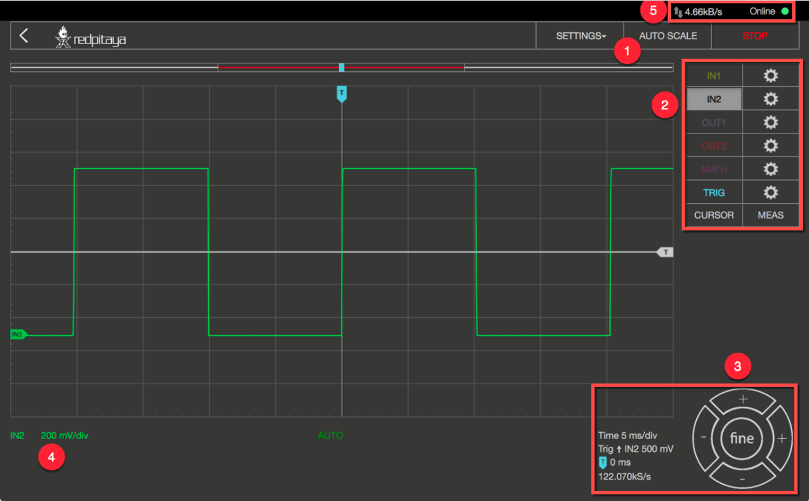
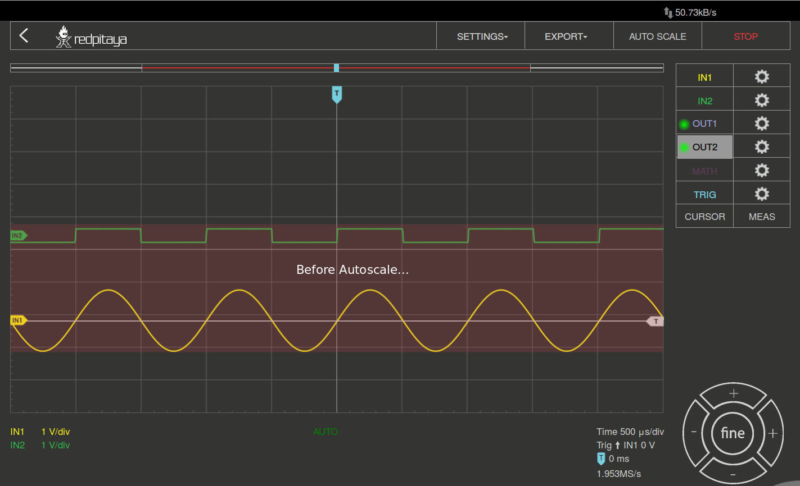
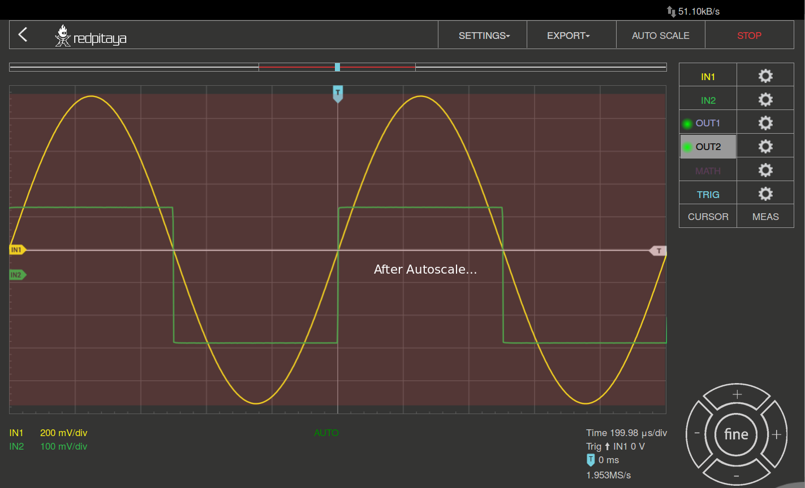
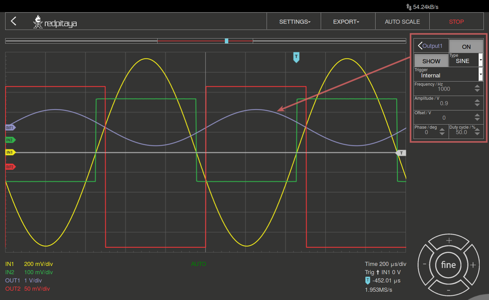

.. _oscapp:

Oscilloscope with Signal Generator
##################################

This application will turn your HAMlab into a 2-channel Oscilloscope and 2-channel Signal generator. It is the perfect tool for educators, students, makers, hobbyists and professionals seeking affordable, highly functional test and measurement equipment. 
It enables generating and measuring electrical signals up to 50MHz. The simple and intuitive user interface provides all the necessary tools for signal analysis and measurements. High end specifications will satisfy more demanding users looking for powerful tools for their working benches. 
The application is web-based and doesn’t require installation of any native software. Users can access them via any web browser (Google Chrome is recommended) using their smartphone, tablet or a PC running any popular operating system (MAC, Linux, Windows, Android and iOS). 
The elements on the Oscilloscope&Sig. Generator application are arranged logically and offer a familiar user interface.

Apart from the graph there are five areas in which the surface is divided:

	 1) Autoscale: Automatically sets up the Oscilloscope settings for the optimal display of the input signals. By pressing the button the voltage axis and time axis are set so that at least one full period of the signal will fill the screen.
	 2) Channels / Trigger / Measuring Tools: This menu provides controls for inputs / outputs, Trigger, guides, and measurements.
	 3) Axis control panel: 
	
		* By pressing the horizontal **+**/**-** buttons the scaling of the X axis is changed and thus the selected time range which is displayed in the graph. 
		* The vertical **+**/**-** buttons change the Y axis, and thus the displayed voltage range of the signal. 
		* In addition, the setting for the time frame, trigger, zero point of the X axis and the sampling rate are displayed.
	 4) Channel Setting display: Indicates the scale of the Y axis for all channels that are switched.
	 5) Osciloscope application network data usage.

Features
--------

Oscilloscope & signal generator main features are listed below:

	* Run/stop and auto set functionality
	* Signals position and scale controls
	* Trigger controls:
	
		* source, 
		* level, 
		* slope
		
	* Trigger modes: 
	
		* auto, 
		* normal and 
		* single triggering
		
	* Input calibration wizard
	* Cursors
	* Measurements
	* Math operations
	* Signal generator controls: 
	
		* waveform, 
		* amplitude, 
		* frequency, 
		* phase
	
**AUTOS CALE**: Automatically sets up the Oscilloscope to best display the input signal. By pressing this button, the voltage axis and the time axis are set so that at least one full period of the signal will fill the screen.

   

**INPUTS**:	
On the right side of the Oscilloscope&Sig. Generator application interface the IN1 and IN2 channels are listed. By a simple click on the name of a channel (not the gear) the channel gets highlighted and you can simply control all the settings of the respective channel.
	
The available settings are the following:

.. image :: Slika_05_OSC.png
   :scale: 40 %
   :alt: Osciloscope settings
   :align: right
	
**SHOW**: 
Shows or hides the curve associated with the channel.

**INVERT***: 
Reflects the graph on the X axis.

**Probe attenuation**: 
The division that was set on the probe. (must be selected manually)

**Vertical offset**: 
Moves the curve up or down.

**LV** and **HV**: 
Are osciloscope input range options of your HAMlab implemented via attenuator. 

	* **HV** represent **higher voltage range** from **-20** to **+20** V.
	* **LV** represent **low voltage range** from **-1** to **1** V. 

**AC** and **DC** coupling: HAMlab enables you to mesure signals in two coupling modes **AC** and **DC**. 

	* **AC** Osciloscope will show **only AC** component of a signal. 
	* **DC** Osciloscope will show **both AC and DC** components of a signal.
	

Output
------

On the right side of the Oscilloscope & Sig. Generator application interface the **OUT1** and **OUT2** channels are listed. 

By a simple click on the name of a channel (not the gear) the channel gets highlighted and you can simply control all the settings of the respective channel. 

The available settings are the following: 

	* **ON**, 
	* **SHOW**, 
	* **Type**, 
	* **Trigger**, 
	* **Frequency**, 
	* **Amplitude**, 
	* **Offset**, 
	* **Phase** and 
	* **Duty cycle**. 

Various waveforms are available for output: **SINE** (sinus), **SQUARE** (rectangle) **TRIANGLE** (triangle), **SAWU** (rising sawtooth), **SAWD** (falling sawtooth), **DC** and **PWM** (Pulse Width Modulation).

**TRIGGER**:

.. image :: Slika_07_OSC.png
   :scale: 40 %
   :alt: Osciloscope settings
   :align: right

The Trigger is used to enable the scope to display changing waveforms to be displayed on the screen of the scope in a steady fashion. The parameter Source defines the trigger source used for this. The trigger source can be input channel 1 (IN1) or input channel 2 (IN2) or an external source. The available settings are the following:

	* **LEVEL** Trigger level value is used to determinate at which value of signal amplitude the trigger condition will be satisfied(true). When signal amplitude achieves/cross this value the trigger state is set to “true”. Following “true” trigger condition the acquisition and signal plotting will be executed.
	* **EGDE** Since during the time sweep(acquisition) signal amplitude can cross trigger level from higher value to the lowest one or vice versa. The edge setting will determinate at which case the trigger condition will be set to “true”.
	* **NORMAL** The acquisition(trace (re)plotting) is executed only if the trigger state is “true”. In other words; signal needs to satisfy trigger condition in order to be acquired and (re)plotted by the Oscilloscope.
	* **SINGLE** After trigger conditions are satisfied by the observed signal the acquisition is executed only once and trace re-plotting is stopped regardless of the repetitive “true” trigger states. 
	* **AUTO** Trigger state and conditions are disregarded. Signal acquisition and signal trace re-plotting are executed in repetitive(continuous) manner. This setting is default one.
	* **STOP** Pause triggers.
	* **RUN** Starts/continues triggering.

The Source parameter defines the source used for this purpose. With the **IN1** or the **IN2** the signal at the respective input is selected; with the **EXT** you can invoke the trigger from outside through external BNC input connector located on front pannel indicated with **EXT TRIG**.

**MATH**:

Among the more interesting features of a digital oscilloscope is the "math" channel. 
The available settings are the following:
	
	* **\+** Adds the selected channels. 
	* **\-** Subtract the selected channels. 
	* **\*** Multiply selected channels.
	* **ABS** Gives an absolute value of the selected signal.
	* **dy/dt** Gives an time derivation of the selected signal.
	* **ydt** Gives an time integration of the selected signal. 
	* **INVERT** Inverts the signal.

.. image :: Slika_08_OSC.png
   :alt: MATH
   :align: center
   

**CURSOR**:
This feature enables the user to easily get the data of relevant basic measurements such is: signal period, amplitude, time delay, amplitude difference between two points, time difference between two points and etc.

.. image :: Slika_09_OSC.png
   :alt: CURSOR
   :align: center

**NAVIGATE**:
When you have a lot of data to analyze, it is very important to get through them easily. Navigate left and right by dragging the data where you want and effortlessly zoom in and out by using your mouse scroll wheel.

.. image :: Slika_04_OSC.png
   :alt: NAVIGATE
   :align: center

**MEASUREMENTS**:
The menu can be found under the **MEAS** button. Here you can select up to 4 measured values in total, then provide the corresponding values. 

In the Operator field select the desired measurement and then set the Signal from which channel the value should be taken. One click on **DONE** shows the value in the bottom of the channel settings. You may choose among the following:
	
	* **P2P**: The difference between the lowest and the highest measured voltage value. 
	* **MEAN**: The calculated average of the signal. 
	* **MAX**: The highest measured voltage value. 
	* **MIN**: The lowest measured voltage value. 
	* **RMS**: The calculated RMS (root mean square) of the signal. 
	* **DUTY CYCLE**: The Signal’s duty cycle (ratio of the pulse duration and period length). 
	* **PERIOD**: Displays the period length, the time length of a vibration. 
	* **FREQ**: The frequency of the signal.

NAVIGATE

.. image :: Slika_10_OSC.png
   :alt: MEASUREMENTS
   :align: center
