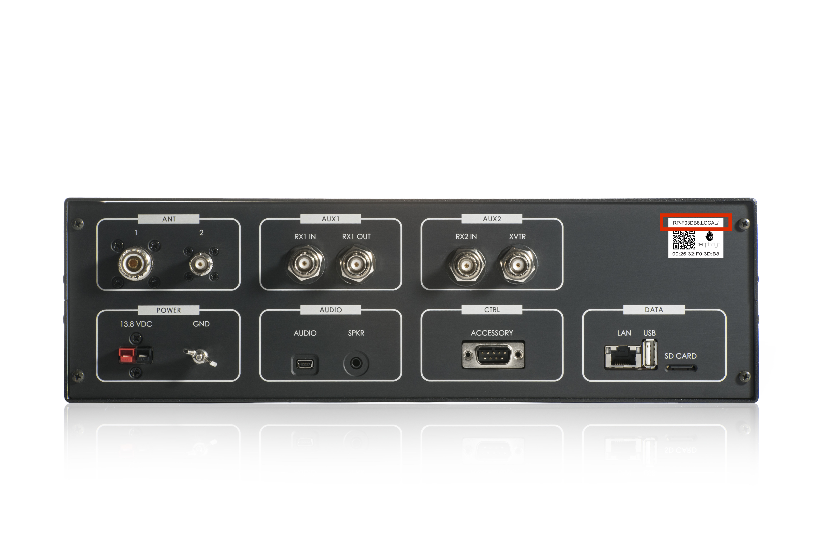
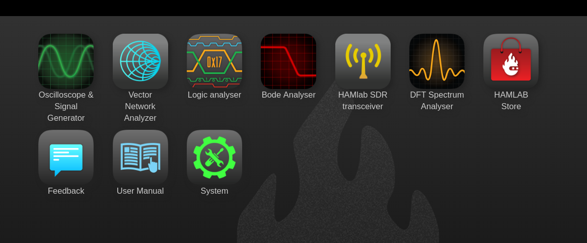

.. _sdr:

Power SDR
######### 

Power SDR installation and SDR configuration
********************************************

.. _here: http://downloads.redpitaya.com/hamlab/powersdr/Setup_PowerSDR_Charly_25_HAMlab_STEMlab_Edition.exe

Click here_ to download Power SDR installation package.

1. Start the installation by double clicking on the Setup_PowerSDR_STEMlab_HAMlab_Edition.exe file.

	.. image :: PowerSDRinstallation1.PNG
		:align: center

2. If you are asked for extended user access rights during the installation click Yes! Running installer with administration rights will work as well. 
	
	.. image :: PowerSDRinstallation2.png
		:scale: 70%
   		:align: center
		
On Windows 10 you might get warning of Unknown Publisher you can procede with installation by clicking on "more info" and then "Run anyway".
 
	.. image:: PowerSDRinstallation3.PNG
		:scale: 75 %
   		:align: center
	
	.. image:: PowerSDRinstallation4.PNG
		:scale: 75 %
   		:align: center
	

3. Follow the instructions of the setup routine and accept the license agreements if asked for.

	.. image:: Capture1.PNG
		:scale: 75 %
   		:align: center

	.. image:: Capture2.PNG
		:scale: 75 %
   		:align: center
		
	.. image:: Capture3.PNG
		:scale: 75 %
   		:align: center

	.. image:: Capture4.PNG
		:scale: 75 %
   		:align: center

	.. image:: Capture5.PNG
		:scale: 75 %
   		:align: center

	.. image:: Capture6.PNG
		:scale: 75 %
   		:align: center

	.. image:: Capture7.PNG
		:scale: 75 %
   		:align: center

	.. image:: Capture8.PNG
		:scale: 75 %
		:align: center

4. At the end of the installation you are asked if you want to run PowerSDR software immediately, feel free to do so.

	.. image:: Capture9.PNG
		:scale: 75 %
   		:align: center

5. PowerSDR software will start with the calculation of the FFT wisdom file, **which will take a while** depending on the CPU power of your computer. This is only done once, even after updating the software to a new version in the future:

	.. image:: Capture10.PNG
		:scale: 75 %
   		:align: center

6. After starting the PowerSDR software you will be led through the PowerSDR software specific setup wizard which lets you configure the software to use it with your STEMlab. Pick the HAMlab/STEMlab radio model.

	.. image:: Capture11.PNG
		:scale: 75 %
   		:align: center

7. Select the region where you are using your STEMlab, this is important due to the different frequency ranges your are allowed to transmit in the different countries all over the world:

	.. image:: Capture12.PNG
		:scale: 75 %
   		:align: center

8. Your initial setup is completed click finish.

	.. image:: Capture13.PNG
		:scale: 75 %
   		:align: center

9. Click Power to connect Power SDR with STEMlab. On the screen the input singnal should appear.

	.. image:: Capture20.PNG
		:scale: 75 %
   		:align: center

Power SDR configuration
+++++++++++++++++++++++

Audio configuration (only required for HAMlab 80-10 10W model)

.. image :: ../quickStart/HamLab_images/PowerSDRaudiosetup.PNG

.. HAMlab configuration

    
    
Power SDR basic usage
+++++++++++++++++++++   
 
Putting HAMlab into SDR mode
----------------------------

1. Turn on power supply, HAMlab will start automatically. Next time you can momentary press on the power button to turn it on/off.

2. Make sure your computer is connected to same local area network as HAMlab.

3. On your computer start a WEB browser (Chrome recommended).

4. Type in the HAMlab URL that can be found on the back panel of the HAMlab

   	
HAMlab application page should appear 
     

Connecting Power SDR with HAMlab
--------------------------------

.. image :: ../quickStart/HamLab_images/PowerSDRsetupleft.PNG
   	:align: center
   	
.. image :: ../quickStart/HamLab_images/PowerSDRsetup2.PNG
   	:align: center
   	
.. image :: ../quickStart/HamLab_images/PowerSDRsetup.PNG
   	:align: center
	

Receiving
--------- 

Transmitting
------------

Credits
+++++++

Original developer of sdr-transceiver-hpsdr web application is Pavel Demin. 
Original developer of PowerSDR is FlexRadio Systems. 

Repositories used for our builds:

	- https://github.com/RedPitaya/PowerSDR_HPSDR_mRX_PS
	- https://github.com/RedPitaya/red-pitaya-notes

   
