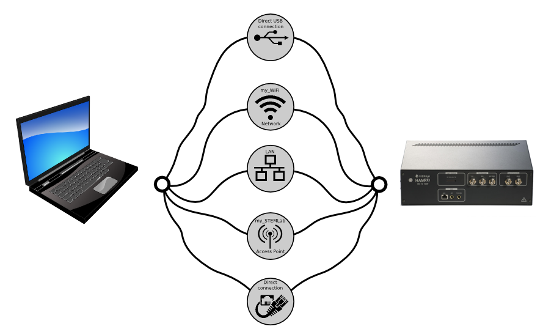
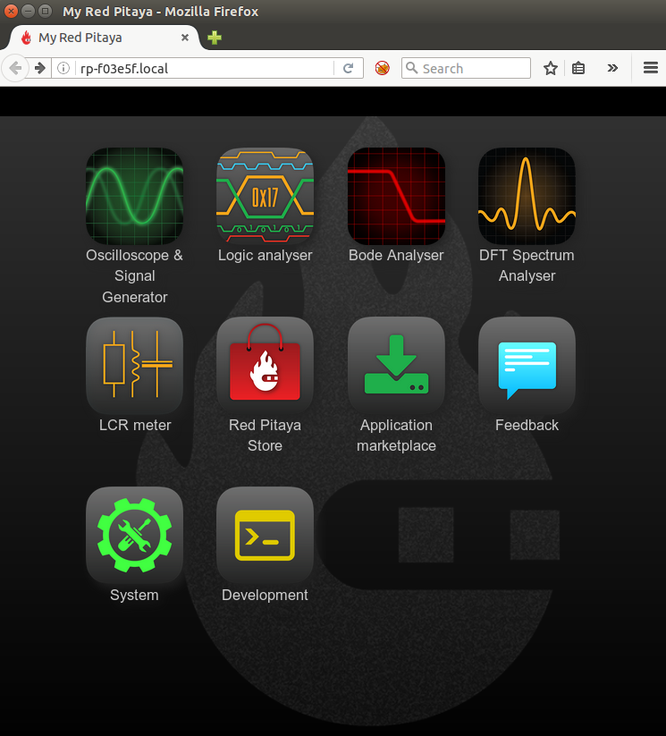
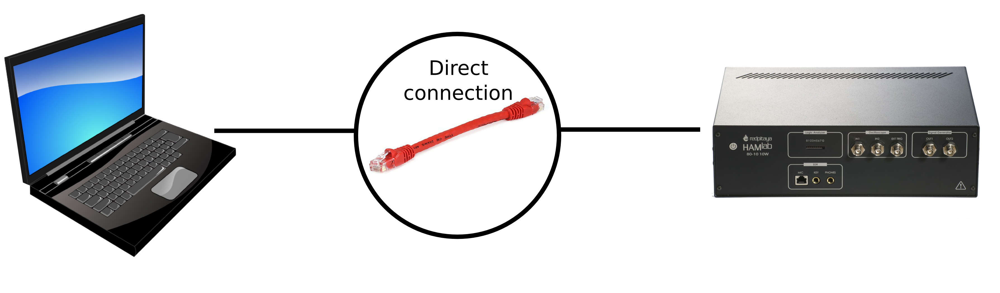
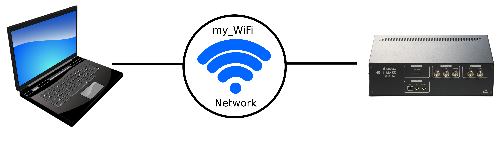
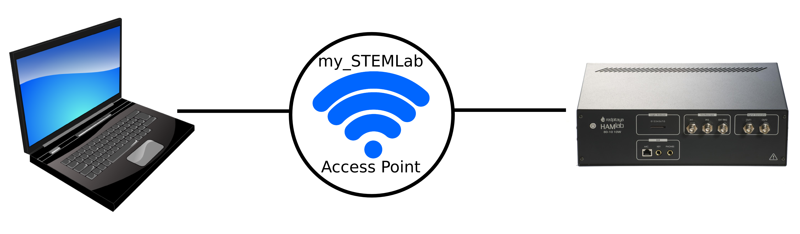
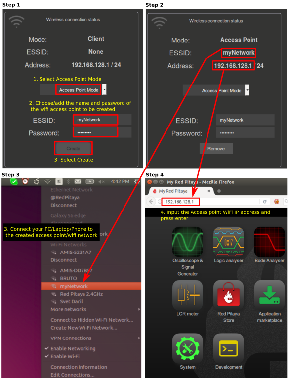

Alternative networking for HAMlab
#################################

.. TODO preveri slovnico

Network connectivity user guide
*******************************

HAMlab is network attached device focused on simple connectivity and quick accessibility. 

HAMlab can be connected over:

    1) Local Area Network (LAN) - Requires DHCP settings on your local network router  
    2) Direct Ethernet cable connection - Requires additional setting on users PC and HAMlab
    3) Wireless Network - Requires an additional WiFi dongle available at store
    4) Access Point Mode - HAMlab creates its own WiFi network

todo:replace this image

Wired
*****

Local Area Network (LAN)  
========================

This is the most common and recommended way of connecting and using your HAMlab. Your LAN network 
needs to have DHCP settings enabled which is the case in majority of the local networks,  whit this,  simple “plug and
play”  approach is enabled. Having HAMlab connected the local network will enable quick access to all applications using only your web browser. Simply follow this 3 simple steps:

    
    1. Connect power supply to the HAMlab
    2. Connect HAMlab to the router or directly to the PC ethernet socket
    3. Open your web browser and in the URL filed type:   ``rp-xxxxxx.local/``
       
.. note::

    ``xxxxxx`` are the last 6 characters from MAC address of your HAMlab. MAC address is written on the back hamlab panel. 

todo:replace image
.. figure:: connect-2.png
    
    Figure 1: Connecting your HAMlab to the LAN network.

After the **third step** you will get a HAMlab main page as shown below.

todo:replace image

    Figure 2: HAMlab main page user interface.
    
Direct Ethernet cable connection
================================

It is possibe to astablish direct connection between your pc and HAMlab. For Windows 10 just connect HAMlab to your computer and access it using ``rp-xxxxxx.local/`` method. 

.. note::

   **Windows 7/8** users should install `Bonjour Print Services <http://redpitaya.com/bonjour>`_,
   otherwise access to ``*.local`` addresses will not work.

If there are some restrictions for the user to have HAMlab on the DHCP LAN network **permanently** there is a 
possibility to directly connect to your HAMlab. This type of connection requires additional settings on your PC
and HAMlab. 

.. note::

    This connection is also arranged via Network manager application so users should first
    have access to the LAN  (DHCP) network in order to arrange static IP on the HAMlab. 
    
How to set direct Ethernet connection is described bellow.

todo:replace image

First step in connecting HAMlab directly to LAN network and setting a static IP on it. 
    1. Use recommended connection described in **Local Area Network (LAN)** section. Once you are successfully 
       connected to your HAMlab, open Network Manager and  chose “Static” option. Input the static IP, default
       getaway and DNS. Click “Apply”. **Fields Gateway and DNS can be left empty.**

    .. image:: connect-11.png

    2. Second step is to set a network setting on the PC
       Here we give an example on the Ubuntu 14.04 but it is very similar on the other OS also.
       To set a direct connection with your PC  follow next steps:
        
        1. Open network manager on your PC
        2. Add new Ethernet connection
           **(There is no need to create new network since you can set static IP settings on the existing network and**
           **skip all steps up to step 5. )**

    .. image:: connect-12.png
    
    3. Select “Ethernet” connection and press “Create” button

    .. image:: connect-13.png
    
    4. Select the name of the new Ethernet connections
    
    .. image:: connect-14.png

    5. Select “Method – Manual”, Press “Add” button and insert:

        - static IP address of your PC (must be different from the IP address of  the HAMlab),  
        - Netmask (input: 255.255.255.0)
        - Getaway (can be left empty)
        - DNS servers  (can be left empty) and click  “Save” button.
    
    .. image:: connect-15.png 

    .. note::
    
        Once you have this settings arranged, connect Ethernet cable between your HAMlab and  PC, open web
        browser, in the web browser URL field input chosen HAMlab static IP (in our example it is 192.168.0.15) 
        and press enter.

todo:replace image
    .. image:: connect-16.png 
    
Wireless
********
    
Wireless Network Connection
===========================

This type of the connection will enable wireless connection to the HAMlab via your local WiFi 
network. In order to connect your HAMlab to the same WiFi network on which you have connected your PC/Laptop 
first you need to use LAN connection. Access your HAMlab via web browser and start Network Manager
application. Trough this application all network settings of the HAMlab are manageable. Simply select the
desired WiFi network, input password and select connect. Once you have arranged WiFi network you don't need LAN
connection anymore and after the restart of the HAMlab it will connect to the preset WiFi network
automatically.  

.. note:: 
	
	Connecting the HAMlab via WiFi network the additional WiFi dongle is needed. WiFi dongle is
	available here [Link to RS or similar].    

todo:replace image

.. TODO link na Local Area Network (LAN)

Steps on how to connect your HAMlab over WiFi network are described bellow:
 
    1. Start your HAMlab web user interface (Use connection described **Local Area Network (LAN) connection )**
    2. Open Network Manager application
    3. Insert WiFi dongle in the USB plug on the HAMlab. Supported WiFi dongles are described here [ `FAQ <http://redpitaya.com/faq/>`_ ]
    

todo:replace image
    .. image:: connect-5.png

    4. When the USB WiFi dongle is plugged in, the system will recognize it and enabled additional settings.
    5. Select Client Mode, Desired WiFi network,  Insert password and click Connect.
    
    .. image:: connect-6.png
    
    6. When your HAMlab is connected the IP address will be shown on the user interface. This IP address is 
       only for WiFi connection. You can check the connection by inputing a WiFi IP address in the web browser URL 
       field (press enter after inputing). 
       
    .. image:: connect-7.png   

    Now you have WiFi connection established. If you restart HAMlab it will connect to selected network 
    automatically (if selected network is available). Also you can disconnect LAN connection and your HAMlab will be 
    still available over the WiFi network i.e WiFi IP address.
    
    .. note::
    
        WiFi networks are generally not robust and the full performances of the HAMlab applications can be 
        affected. 
        
Access Point mode
=================

This type of the connection is ideal if there is no LAN or WiFi network. HAMlab will simply create its own WiFi
network on which users PC/Laptop or Tablet can be connected. Access Point mode is arranged via Network Manager 
application where you give the name to your HAMlab network and enable it. Since Access Point mode is enabled via 
Network Manager application  this means that first you need to use LAN network, access your HAMlab and arrange
the Access Point mode. After this there is no need for LAN network and after restarting the HAMlab the settings are
saved.  

.. note:: 
	
	Connecting the HAMlab via Access Point mode the additional WiFi dongle is needed. WiFi dongle is 
	available [Link to RS or similar].

todo:replace image

How to create Access Point network and connect to it is describe below.
    1. Start your HAMlab web user interface (Use connection described **Local Area Network (LAN) connection )**
    2. Open Network Manager application
    3. Input the name and password of the Access Point network to be created
       (Password name should be at least 8 characters long. Do not use special signs.)
    4.  Connect your PC/Laptop/Tablet/Phone to the network created by HAMlab
    5. Input Access Point network IP address to the web browser URL field and press enter.
    
    .. note::
    
        IP address in Access Point mode is always the same: 192.168.128.1

