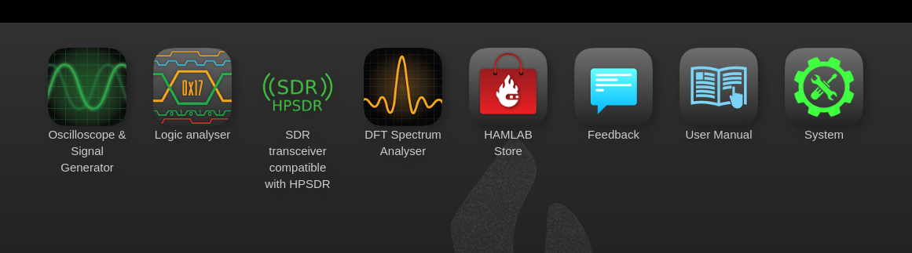

HAMlab models that are covered by this user manual:

+-------------------+------------------+----------------------------------------------------+
| **HAMlab model**  | **release date** | **what has changed to previous model**             |
+-------------------+------------------+----------------------------------------------------+
| HAMlab 80-10 10W  | Dec. 2016        |                                                    |
+-------------------+------------------+----------------------------------------------------+
|                   |                  | * all amateur transmit bands are now supported,    |
| HAMlab 160-6 10W  | Apr. 2017        | * USB audio card was replaced with audio codec,    |
|                   |                  | * other improvements                               |
+-------------------+------------------+----------------------------------------------------+

.. note::

	If you have proposal what to improve in next generation please contact us: hamlab@redpitaya.com

What is in the box 
##################

The following accessories and materials are included with your HAMlab kit. Carefully remove the HAMlab device and accessories from its shipping package and identify the items listed below. 

	* HAMlab
	* DC power cord with Anderson Power Pole™ connector
	* Ethernet cable   
	* USB 2.0 Cable - A-Male to Mini-B (only for HAMlab 80-10 10W)
	* Rx fliters bypass BNC cable

.. _shop: http://redpitaya.com/hamlab/#Products

.. _Hercules: https://www.hercules.com/uk/leisure-controllers/bdd/p/248/djcontrol-instinct-s-series/

Other additional requirements
#############################

In addition to the supplied accessories, software and cables supplied with the HAMlab, you will need to provide the following:

	* An **HF-Antenna** or dummy load with BNC or SO-239 connector
	* powered **stereo speakers** (computer type) or stereo headphones
	* **router** with enabled **DHCP** and connection to the internet
	* good RF **ground**	
	* HAMlab compatible Microphone 	available in HAMlab shop_ .
	* A stabilized DC 13.8 VDC, 4A **Power Supply**
	* Oscilloscope and logic analyzer probes available in HAMlab shop_ . 
	* DJControl Instinct S Series available from Hercules_ or other midi controller.

SDR application requirements:

	* Personal computer (PC) running Windows 7 or later. Either 32 or 64-bit operating systems are supported. 

Instrumentation applications requirements: 

	* All instrumentation applications are WEB based and don’t require the installation of any native software. Users can access them via a browser using their smartphone, tablet or a PC running any popular operating systems (macOS, Linux, Windows, Android or iOS).

Start using HAMlab measurement instruments
##########################################

Connecting the cables
---------------------

Back panel connections
++++++++++++++++++++++

HAMlab should be powered by DC 13.8 V Power Supply that can provide at least 4A of constant power. Make sure that is turned off and then use DC power cord with Anderson Power Pole™ connector to connect it with HAMlab. RED wire is positive (+) while BLACK wire is negative (-), double check to not mix the colours or polarity! 
Don’t turn on the power supply yet.

.. image:: HamLab_images/2.3.1.1._Back_panel_connections.jpg

Anderson Power Pole™ power connector **(1)**
Ethernet connection **(2)** - connect the HAMlab to your local network using ethernet cable.

.. note::
	
	Other connections are at the moment not important, you can read more about them later in the :ref:`back` section.

Front panel connections
+++++++++++++++++++++++

.. image:: HamLab_images/2.3.1.2._Front_panel_connections.jpg

Logic analyzer probes **(1)**, Oscilloscope probes **(2)**, Signal generator connections **(3)** 

Turning it on and start using measuring instruments
---------------------------------------------------

	1.) Turn on power supply, and press momentary power button on the HAMlab to turn it ON. Blue led on power button will turn on and after 30s HAMlab will be ready to use.	
	
	2.) Make sure your computer is connected to same local area network as HAMlab.
	
	3.) On your computer start a WEB browser (Chrome recommended).
	
	4.) Type in the HAMlab URL.
	
Example:

.. note::
	URL can be found on the back panel of the HAMlab. See image below. 
	

.. image:: HamLab_images/4_Type_in_the_HAMlabURL.jpg

HAMlab application page should appear where measurement applications are listed.
     

Click on application to run it. 

.. note:: 
	
	More details about HAMlab instruments can be found in the Applications & features section.
	
	Instruments applications documentation:

	* :ref:`oscapp`
	* :ref:`laapp`
	* :ref:`saapp`

Start using HAMlab as Radio Station - SDR
#########################################

Connecting the cables
---------------------

Back panel connections
++++++++++++++++++++++

.. image:: HamLab_images/2.4.1.1._Back_panel_connections.jpg

Antenna - Connect an HF antenna with nominal 50 Ohm impedance to the SO-239 connector.

.. note::
	If you prefer BNC connector you can remove HAMlab top cover and reconnect it from SO-239 to BNC.
	
Ground - Remove the thumb screw marked GND. Connect your central station ground to the thumb screw and screw it back into the radio.

Speakers - connect powered stereo speakers to the jack 

.. tip::

	You can instead of speakers connect headphones on the front panel.

USB cable **(3)** - connect the HAMlab with the PC using USB 2.0 Cable - A-Male to Mini-B. USB cable will provide a way for PowerSDR software to use HAMlabs audio outputs. USB cable for audio is only required for HAMlab 80-10 10W model.

Ethernet Connection **(4)** - connect the HAMlab to your local network using ethernet cable

HAMlab should be powered by DC 13.8V Power Supply that can provide at least 4 A of constant power. 
Make sure that is turned off and then use DC power cord with Anderson Power Pole™ connector **(1)** to connect it with HAMlab. 
RED wire is positive (+) while BLACK wire is negative (-), double check to not mix the colours or polarity! 
Don’t turn on the power supply yet.

Mount Rx filters bypass BNC loopback cable from RX1 IN to RX1 OUT **(2)**.

.. note::

	Other connections are at the moment not important, you can read more about them later in the :ref:`back` section.

Front panel connections
+++++++++++++++++++++++

.. image:: HamLab_images/2.4.1.2._Front_panel_connections.jpg

Microphone **(1)**

.. note::

	More information about compatibility of microphone, key and headphones and front panel connections in general can be found in the :ref:`front` section.

Iambic Morse Code Paddle Keyer **(2)**

.. note::

	Keyer is supported only with software 0.97-93 or later. Please check for software update.  

Phones **(3)** (optional if speakers are not connected)

Turn it on & put HAMlab in SDR mode
+++++++++++++++++++++++++++++++++++

1.) Turn on power supply, HAMlab will start automatically. Next time you can momentary press on the power button to turn it on/off.

2.) Make sure your computer is connected to same local area network as HAMlab.

3.) On your computer start a WEB browser (Chrome recommended).

4.) Type in the HAMlab URL that can be found on the back panel of the HAMlab

.. image:: HamLab_images/4_Type_in_the_HAMlabURL.jpg

HAMlab application page should appear 
     

Congratulations, HAMlab is now ready for use, now let’s install Power SDR.

.. note:: 

	Exiting this SDR WEB application will close the connection to Power SDR.

Power SDR installation and SDR configuration
--------------------------------------------

.. _here: http://downloads.redpitaya.com/hamlab/powersdr/Setup_PowerSDR_Charly_25_HAMlab_STEMlab_Edition.exe

Click here_ to download Power SDR installation package.

1. Start the installation by double clicking on the Setup_PowerSDR_STEMlab_HAMlab_Edition.exe file.

	.. image :: ../appsFeatures/PowerSDRinstallation1.PNG
		:align: center

2. If you are asked for extended user access rights during the installation click Yes! Running installer with administration rights will work as well. 
	
	.. image :: ../appsFeatures/PowerSDRinstallation2.png
		:scale: 70%
   		:align: center
		
On Windows 10 you might get warning of Unknown Publisher you can procede with installation by clicking on "more info" and then "Run anyway".
 
	.. image:: ../appsFeatures/PowerSDRinstallation3.PNG
		:scale: 75 %
   		:align: center
	
	.. image:: ../appsFeatures/PowerSDRinstallation4.PNG
		:scale: 75 %
   		:align: center
	

3. Follow the instructions of the setup routine and accept the license agreements if asked for.

	.. image:: ../appsFeatures/Capture1.PNG
		:scale: 75 %
   		:align: center

	.. image:: ../appsFeatures/Capture2.PNG
		:scale: 75 %
   		:align: center
		
	.. image:: ../appsFeatures/Capture3.PNG
		:scale: 75 %
   		:align: center

	.. image:: ../appsFeatures/Capture4.PNG
		:scale: 75 %
   		:align: center

	.. image:: ../appsFeatures/Capture5.PNG
		:scale: 75 %
   		:align: center

	.. image:: ../appsFeatures/Capture6.PNG
		:scale: 75 %
   		:align: center

	.. image:: ../appsFeatures/Capture7.PNG
		:scale: 75 %
   		:align: center

	.. image:: ../appsFeatures/Capture8.PNG
		:scale: 75 %
		:align: center

4. At the end of the installation you are asked if you want to run PowerSDR software immediately, feel free to do so.

	.. image:: ../appsFeatures/Capture9.PNG
		:scale: 75 %
   		:align: center

5. PowerSDR software will start with the calculation of the FFT wisdom file, **which will take a while** depending on the CPU power of your computer. This is only done once, even after updating the software to a new version in the future:

	.. image:: ../appsFeatures/Capture10.PNG
		:scale: 75 %
   		:align: center

6. After starting the PowerSDR software you will be led through the PowerSDR software specific setup wizard which lets you configure the software to use it with your STEMlab. Pick the HAMlab/STEMlab radio model.

	.. image:: ../appsFeatures/Capture11.PNG
		:scale: 75 %
   		:align: center

7. Select the region where you are using your STEMlab, this is important due to the different frequency ranges your are allowed to transmit in the different countries all over the world:

	.. image:: ../appsFeatures/Capture12.PNG
		:scale: 75 %
   		:align: center

8. Your initial setup is completed click finish.

	.. image:: ../appsFeatures/Capture13.PNG
		:scale: 75 %
   		:align: center

9. Click Power to connect Power SDR with STEMlab. On the screen the input singnal should appear.

	.. image:: ../appsFeatures/Capture20.PNG
		:scale: 75 %
   		:align: center

.. note::
 
	Power SDR software is described in :ref:`sdr` section.

.. tip::
	Optionaly you can connect MIDI controller to your PC. MIDI controller can be used to control radio software parameters like frequency with physical knobs.
	
