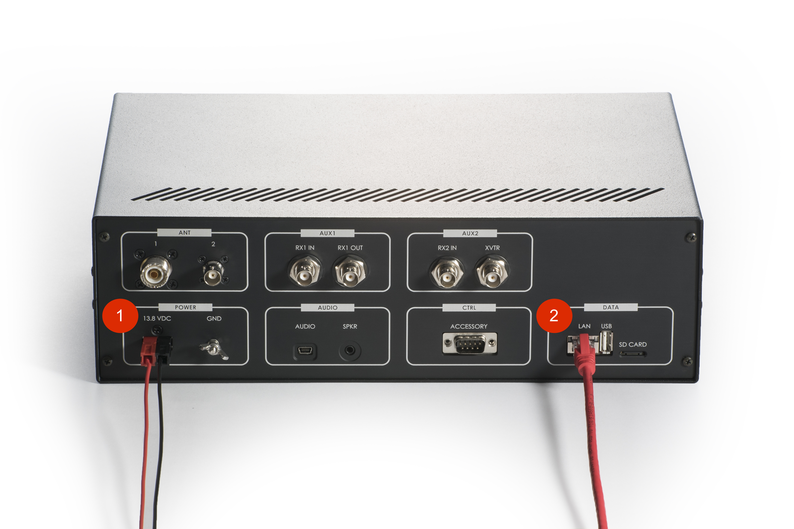
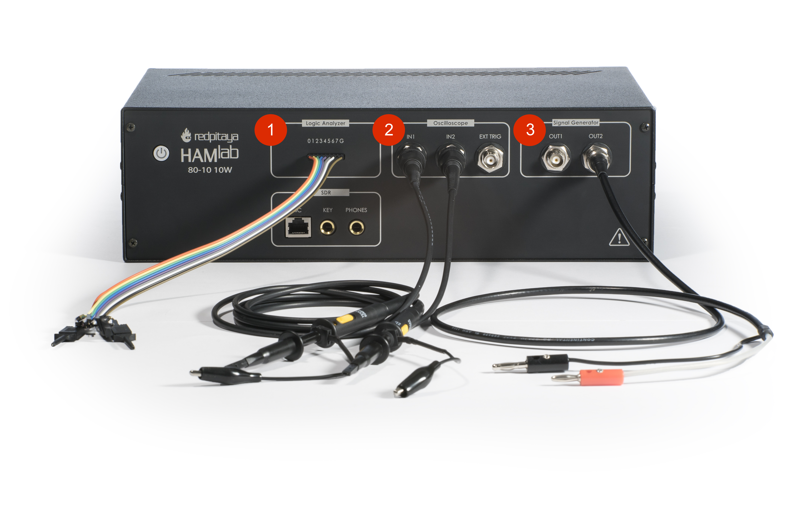
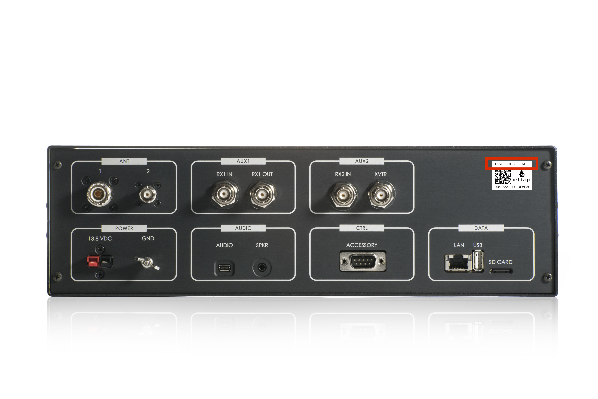
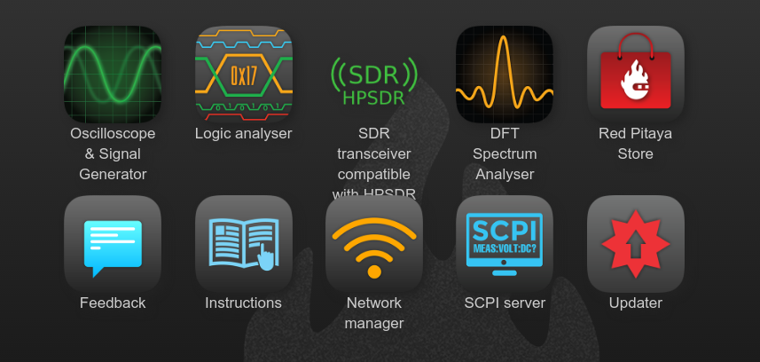
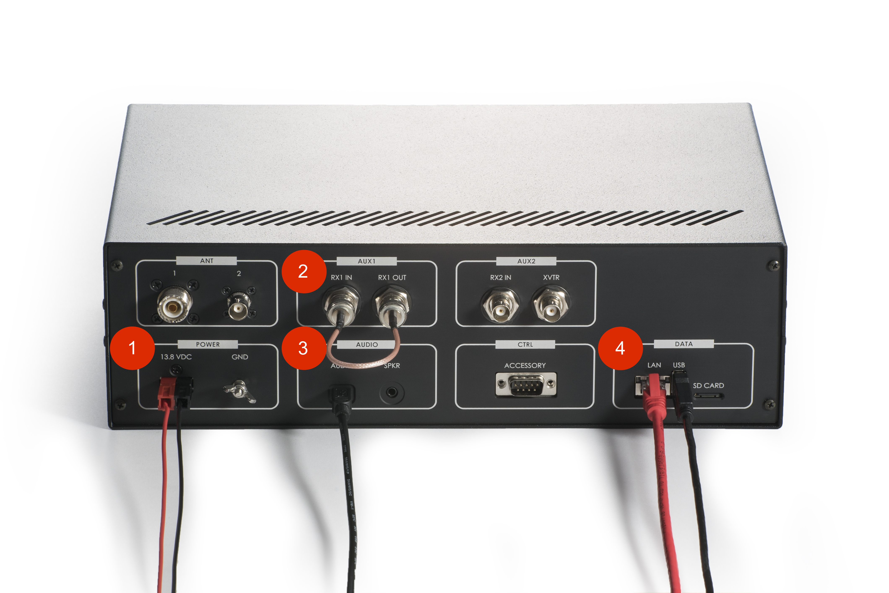
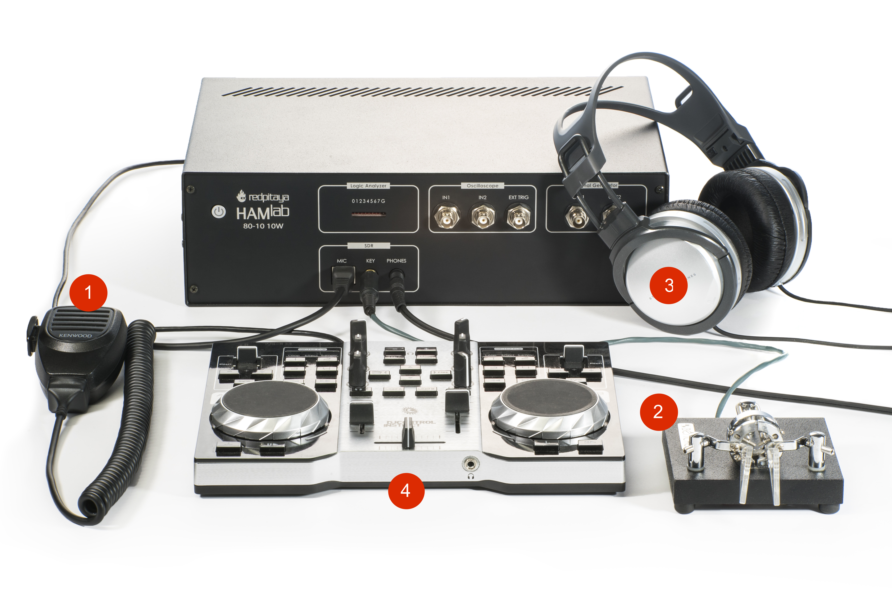

What is in the box 
##################

The following accessories and materials are included with your HAMlab kit. Carefully remove the HAMlab device and accessories from its shipping package and identify the items listed below. 

	* HAMlab 80-10 10W
	* DC power cord with Anderson Power Pole™ connector
	* Ethernet cable   
	* USB 2.0 Cable - A-Male to Mini-B

.. _shop: http://redpitaya.com/hamlab/#Products
.. _Hercules: https://www.hercules.com/uk/leisure-controllers/bdd/p/248/djcontrol-instinct-s-series/

Other additional requirements
#############################

In addition to the supplied accessories, software and cables supplied with the HAMlab, you will need to provide the following:

	* An **HF-Antenna** or dummy load with BNC or SO-239 connector
	* powered **stereo speakers** (computer type) or stereo headphones
	* **router** with enabled **DHCP** and connection to the internet
	* good RF **ground**	
	* HAMlab compatible Microphone 	available in HAMlab shop_ .
	* A stabilized DC 13.8 VDC, 4A **Power Supply**
	* Oscilloscope and logic analyzer probes available in HAMlab shop_ . 
	* DJControl Instinct S Series available from Hercules_ or other midi controller.

SDR application requirements:

	* Personal computer (PC) running Windows 7 or later. Either 32 or 64-bit operating systems are supported. 

Instrumentation applications requirements: 

	* All instrumentation applications are WEB based and don’t require the installation of any native software. Users can access them via a browser using their smartphone, tablet or a PC running any popular operating systems (macOS, Linux, Windows, Android or iOS).

Start using HAMlab measurement instruments
##########################################

Connecting the cables
---------------------

Back panel connections
++++++++++++++++++++++

HAMlab should be powered by DC 13.8 V Power Supply that can provide at least 4A of constant power. Make sure that is turned off and then use DC power cord with Anderson Power Pole™ connector (1) to connect it with HAMlab. RED wire is positive (+) while BLACK wire is negative (-), double check to not mix the colours or polarity! 
Don’t turn on the power supply yet.

**Ethernet Connection** (2)- connect the HAMlab to your local network using ethernet cable.

.. note::
	
	Other connections are at the moment not important, you can read more about them later in the :ref:`back` section.

Front panel connections
+++++++++++++++++++++++

1. Logic analyzer probes 
2. Oscilloscope probes 
3. Signal generator connections 

Turning it on and start using measuring instruments
---------------------------------------------------

	1.) Turn on power supply, and press momentary power button on the HAMlab to turn it ON. Blue led on power button will turn on and after 30s HAMlab will be ready to use.	
	
	2.) Make sure your computer is connected to same local area network as HAMlab.
	
	3.) On your computer start a WEB browser (Chrome recommended).
	
	4.) Type in the HAMlab URL.

	

.. note:
	
	URL can be found on the back panel of the HAMlab.

HAMlab application page should appear where measurement applications are listed.
     

Click on application to run it. 

.. note:: 
	
	More details about HAMlab instruments can be found in the Applications & features section.
	
	Instruments applications documentation:

	* :ref:`oscapp`
	* :ref:`laapp`
	* :ref:`saapp`

Start using HAMlab as Radio Station - SDR
#########################################

Connecting the cables
---------------------

Back panel connections
++++++++++++++++++++++

Antenna - Connect an HF antenna with nominal 50 Ohm impedance to the SO-239 connector.

.. hint::
	If you prefer BNC connector you can remove HAMlab top cover and reconnect it from SO-239 to BNC.
	
Ground - Remove the thumb screw marked GND. Connect your central station ground to the thumb screw and screw it back into the radio.

Speakers - connect powered stereo speakers to the jack 

.. note::

	You can instead of speakers connect headphones on the front panel.

USB cable - connect the HAMlab with the PC using USB 2.0 Cable - A-Male to Mini-B

Ethernet Connection - connect the HAMlab to your local network using ethernet cable

HAMlab should be powered by DC 13.8V Power Supply that can provide at least 4 A of constant power. Make sure that is turned off and then use DC power cord with Anderson Power Pole™ connector to connect it with HAMlab. RED wire is positive (+) while BLACK wire is negative (-), double check to not mix the colours or polarity! 
Don’t turn on the power supply yet.

.. note::

	Other connections are at the moment not important, you can read more about them later in the :ref:`back` section.

Front panel connections
+++++++++++++++++++++++

Phones (optional if speakers are not connected)

Iambic Morse Code Paddle Keyer Plug

.. note::

	Currently keyer is not supported by software. Software support for it will be availabe in one of incomming software updates. 

.. note::

	More information about compatibility of microphone, key and headphones and front panel connections in general can be found in the :ref:`front` section.

Turn it on & put HAMlab in SDR mode
+++++++++++++++++++++++++++++++++++

1.) Turn on power supply, HAMlab will start automatically. Next time you can momentary press on the power button to turn it on/off.

2.) Make sure your computer is connected to same local area network as HAMlab.

3.) On your computer start a WEB browser (Chrome recommended).

4.) Type in the HAMlab URL that can be found on the back panel of the HAMlab

HAMlab application page should appear 
     

In order to use HAMlab in SDR mode You must run SDR HPSDR web application first. 

.. image :: ../appsFeatures/hpsdr_icon.png
   :alt: icon
   :align: center
   
Click on the SDR icon in order to put HAMlab into SDR mode. While web application is running HAMlab will be in SDR mode and you can connect to it with PowerSDR software to use it as radio.
   
.. image :: ../appsFeatures/webapp.png   

Congratulations, HAMlab is now ready for use, now let’s install Power SDR.

.. note:: 

	Exiting this SDR WEB application will close the connection to Power SDR.

Power SDR installation and SDR configuration
--------------------------------------------

.. _here: http://downloads.redpitaya.com/hamlab/powersdr/Setup_PowerSDR_Charly_25_HAMlab_Edition.exe
Click here_ to download Power SDR installation package.

1. Start the installation by double clicking on the Setup_PowerSDR_Charly_25_HAMlab_Edition.exe file.

	.. image :: HamLab_images/PowerSDRinstallation1.PNG

2. If you are asked for extended user access rights during the installation click Yes! Running installer with administration rights will work as well. 
	
	.. image :: HamLab_images/PowerSDRinstallation2.PNG
	
On Windows 10 you might get warning of Unknown Publisher you can procede with installation by clicking on "more info" and then "Run anyway".
 
	.. image :: HamLab_images/PowerSDRinstallation3.PNG
	.. image :: HamLab_images/PowerSDRinstallation4.PNG

3. Follow the instructions of the setup routine and accept the license agreements if asked for.

4. At the end of the installation you are asked if you want to run PowerSDR Charly 25 / Hamlab Edition software immediately, feel free to do so.

5. After starting the PowerSDR Charly 25 / Hamlab Edition software the first time you will be led through the PowerSDR Charly 25 / Hamlab Edition specific setup wizard which lets you configure the software to use it with your Hamlab.

So please choose Hamlab as your radio model:

.. image :: ../appsFeatures/powersdrsetup01.jpg

6. Confirm the RedPitaya as HPSDR hardware (currently there is no other type of hardware available for the Hamlab).

.. image :: ../appsFeatures/powersdrsetup02.jpg

7. Select the region where you are using your Hamlab, this is important due to the different frequency ranges your are allowed to transmit in the different countries all over the world:

.. image :: ../appsFeatures/powersdrsetup03.jpg

8. Your initial setup is completed:

.. image :: ../appsFeatures/powersdrsetup04.jpg

9.  After clicking the Finish button PowerSDR Charly 25 / HAMlab Edition will start with the calculation of the FFT wisdom file, **which will take a while** depending on the CPU power of your computer.
This is only done once, even after updating the software to a new version in the future:

.. image :: ../appsFeatures/powersdrsetup05.jpg

10. When all calculations are done, PowerSDR Charly 25 / HAMlab Edition will come up with the main window:

.. image :: ../appsFeatures/powersdrsetup06.jpg

11. Click Power to connect Power SDR with HAMlab. On the screen the input singnal should appear.

.. image :: HamLab_images/SDRconnectedproperlyreceiversignalonscreen.PNG

.. note::
 
	Power SDR software is described in :ref:`sdr` section.

Troubleshooting
###############

Damaged or currupted SD card
----------------------------

HAMlabs equivalent for geting your sistem back into factory setings is preparing new sd card. This should be done in case of sd card failiure. In that situation new HAMlab OS memory card will have to be prepaired.
Please folow this steps to achieve this:

 1) Power off HAMlab
 2) Remove sd card from HAMlab
 3) Insert sd cart into computer
 4) Folow new :ref:`sdcard` guide to create new sd card with HAMlab OS
 
In case that written sd card does not behave as expected please use new sd card, size should be at least 4 Gb and it should be specified as class 10.

SDR HPSDR Web application not running
-------------------------------------

In case that you see this dialog.

.. image :: HamLab_images/SDRapplicationnotrunningonHAMlaborcnnectionproblems.PNG

when trying to run PowerSDR please run SDR HPSDR web application before starting Power SDR.
